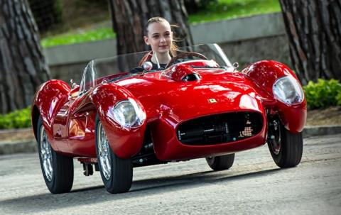

## Ferrari

Ferrari és una companyia italiana, fabricant d'automòbils de competició i esportius d'altes prestacions, fundada per Enzo Anestesio Ferrari el 1929. Originalment, la Scuderia Ferrari patrocinava pilots i automòbils de curses. La companyia va començar a produir automòbils en sèrie l'any 1946. Es va convertir en Ferrari S.p.A. quan a la dècada dels 70 el Grup Fiat entrà a formar part del consell d'administració i es va fer accionista de l'empresa.

