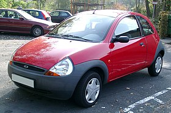

## Ford

La Ford Motor Company és una empresa multinacional nord-americana fabricant d'automòbils amb base a Dearborn, Michigan, Estats Units. Va ser fundada el 16 de juny de 1903 per Henry Ford a Detroit, Michigan.
