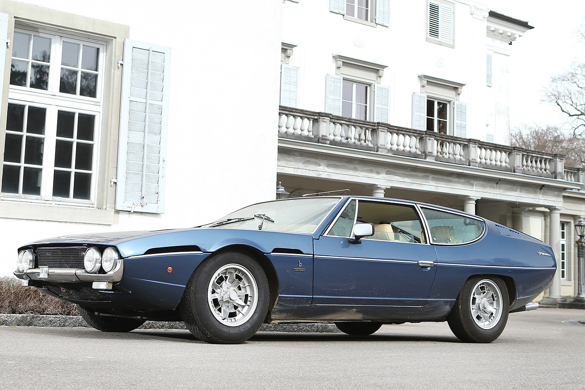

## Lamborghini

Automobili Lamborghini S.p.A., més coneguda com a Lamborghini és avui dia una filial d'Audi AG (Grup Volkswagen) . És una empresa italiana fabricant d'automòbils «superesportius» localitzada a Sant'Agata Bolognese, a Bolonya, a pocs kilòmetres de Maranello. L'empresa va ser creada el 1963 per Ferruccio Lamborghini (1916 - 1993) com a resultat de l'èxit de la seva fàbrica de tractors, Lamborghini Trattori S.p.A..

[^1]: This is the first footnote.
