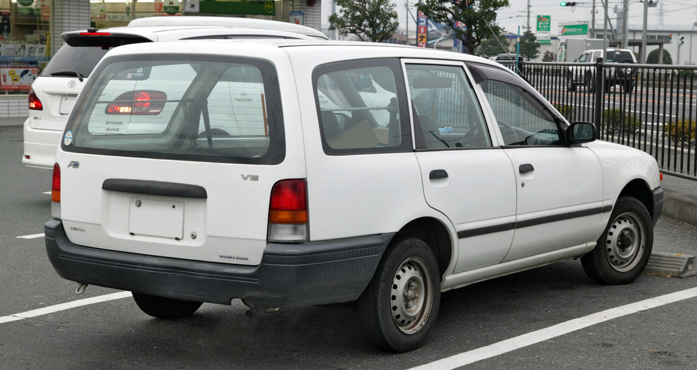

# Nissan

Nissan Motor Co., Ltd. (日産自動車株式会社 , Nissan Jidōsha Kabushiki-gaisha?) és un fabricant d'automòbils japonès que abans comercialitzava els seus vehicles amb el nom de Datsun. La companyia té la seu a la zona de Ginza de Chuo, Tòquio, però hi ha plans per moure-la a Yokohama, Kanagawa abans del 2010, amb les obres començant el 2007. El 1999, Nissan es va aliar amb Renault S.A., de França. Nissan és entre els tres primers fabricants asiàtics, per darrere de Toyota i per davant d'Honda, tot i que amb les dificultats financeres entre 1998 i 2002, van produir menys que Honda en aquest període.
