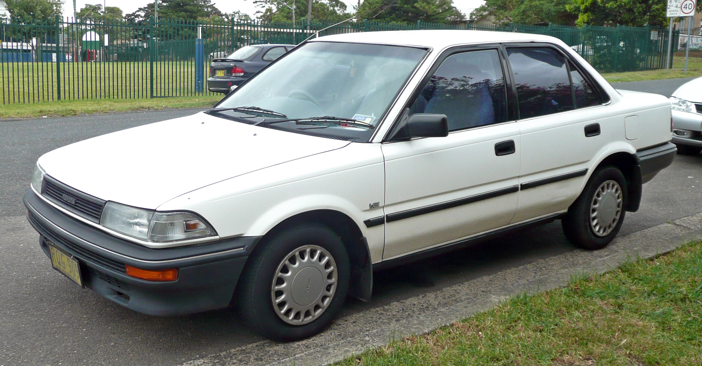

## Toyota

L'empresa va començar com un departament, iniciat el 1933 per Kiichiro Toyoda, filial de la companyia del seu pare Toyota Industries per a produir automòbils. Va produir el primer vehicle de passatgers l'any 1935,i el 1937 es constitueix com a companyia independent. La seu és a Toyota, Aichi, Japó.
